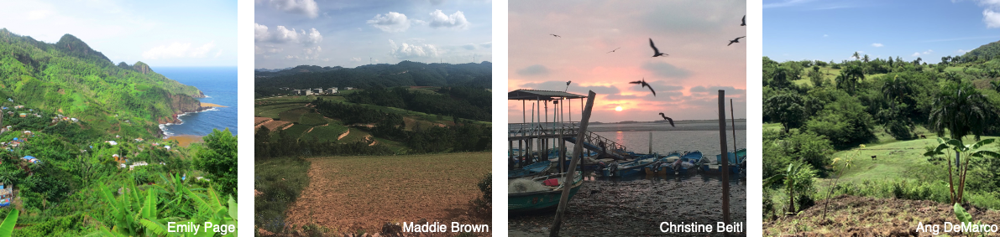

The ENDOW project is a collaborative network of social scientists interested in cross-cultural comparative work.

We are bringing together anthropologists and other social scientists working primarily in rural – and rapidly changing – communities around the world to undertake research that explores key social and environmental dimensions of the human condition -- see the [fieldsites page](https://endowproject.github.io/fieldsites/) to see where we're working. 

We are working to build the networks and infrastructure (including survey protocols, database architectures, and analytical tools) that will facilitate meaningful, productive comparisons -- see the [data management page](https://endowproject.github.io/data-management/) for more on some of these efforts.

Right now, our primary efforts are aimed at understanding "Economic Network Dynamics and the Origins of Wealth (Inequality)" (hence the acronym ENDOW) -- see the [projects page](https://endowproject.github.io/projects/) for more details on our past and current projects. 

Watch this space for more on our work, and please reach out if you're interested in getting involved.

<html>
<head>

<link href="public/css/2-vertical.css" rel="stylesheet">

</head>
<body>

<section>
	

		<article>
			

				<h3><i class="fas fa-bullhorn fa-fw" style="color:#4F9FCF;"></i><a href="{{ 'news' | absolute_url }}">News</a></h3>
				
Read about our newest activities!

			

		</article>
	

</section>

<h3><i class="fas fa-book-open fa-fw" style="color:#4F9FCF;"></i><a href="{{ 'publications' | absolute_url }}">Publications</a></h3>

	

		

		  Barnes, M. L. et al (2020). <a href= "https://doi.org/10.1038/s41558-020-0871-4">Social determinants of adaptive and transformative responses to climate change. </a> Nature Climate Change, 1–6.
		

	

	

		

		  Koster, J. et al (2019). <a href= "https://royalsocietypublishing.org/doi/full/10.1098/rstb.2018.0069">Kinship ties across the lifespan in human communities. </a> Philosophical Transactions of the Royal Society B: Biological Sciences, 374(1780), 20180069.
		

	

	

		

		  Power, E. A., & Ready, E. (2019). <a href= "https://doi.org/10.1098/rstb.2018.0070">Cooperation beyond consanguinity: Post-marital residence, delineations of kin and social support among South Indian Tamils. </a> Philosophical Transactions of the Royal Society B: Biological Sciences, 374(1780), 20180070.
		

	

	<ul class="actions">
        <h3><a href="mailto:endowproject@gmail.com" target = "_blank" class="button button1">Get in touch!</a></h3>
	</ul>

</body>
</html> 

